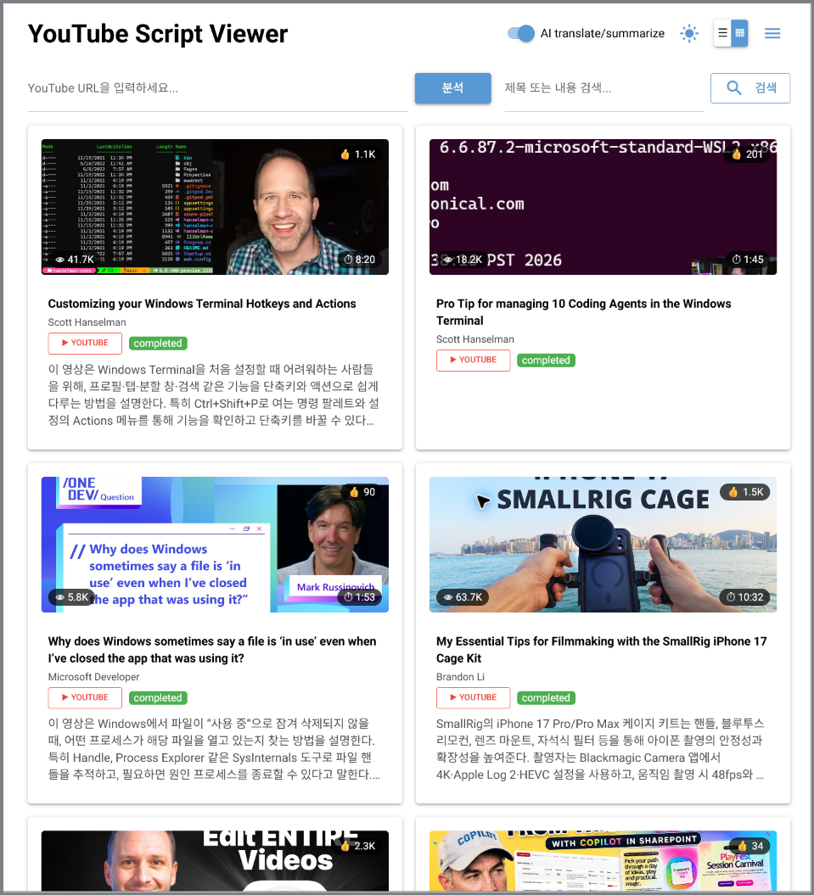

# YouTube Script Viewer

YouTube 영상의 자막을 수집하고, 선택한 LLM으로 한국어 요약과 번역을 생성해
읽기 좋은 문단 단위로 보관하는 로컬 웹 앱입니다. 분석 결과는 SQLite에 누적되며,
검색, 원문·번역 대조, 전체/문단 복사, 재생성 및 중단된 번역 재개를 지원합니다.



> 이 프로젝트는 개인용·로컬 단일 사용자 실행을 우선합니다. 공개 서버로 배포할
> 경우 인증, 접근 제어, 비밀 관리와 사용량 제한을 별도로 추가해야 합니다.

## 목차

- [주요 기능](#주요-기능)
- [처리 흐름과 데이터 보존](#처리-흐름과-데이터-보존)
- [지원 LLM provider](#지원-llm-provider)
- [빠른 시작: Docker Compose](#빠른-시작-docker-compose)
- [Windows 11 + WSL for Containers 설치](#windows-11--wsl-for-containers-설치)
- [LLM 설정](#llm-설정)
- [사용 방법](#사용-방법)
- [로컬 개발과 테스트](#로컬-개발과-테스트)
- [프로젝트 구조](#프로젝트-구조)
- [문제 해결](#문제-해결)
- [선택 사항: Kiro Gateway](#선택-사항-kiro-gateway)
- [오픈소스 공개 전 확인](#오픈소스-공개-전-확인)

## 주요 기능

- YouTube URL에서 영상 메타데이터와 자막 추출
- 긴 자막을 시간, 문장 경계와 길이를 고려한 읽기 좋은 문단으로 분리
- 원문과 한국어 번역을 나란히 표시하고 문단별·전체 복사 제공
- 핵심 요약과 구조화된 요약 생성
- 제목과 분석 내용 검색, 카드/목록 보기, 처리 상태 표시
- OpenAI API, Azure OpenAI, OpenRouter, Google Gemini, Codex, Kiro 지원
- provider마다 **요약 모델**과 **번역 모델**을 독립적으로 설정
- 한국어 원문은 중복 번역하지 않고 번역 영역을 `- BLANK -`로 표시
- 번역 진행 중 결과를 문단별로 갱신하면서 읽던 스크롤 위치 유지
- 재생성·번역 재개 시 기존 결과를 덮어쓰지 않는 리비전 방식
- SQLite 온라인 백업, 무결성 검사와 소프트 삭제

## 처리 흐름과 데이터 보존

```text
브라우저
  └─ NiceGUI / FastAPI
       └─ 분석 파이프라인
            ├─ yt-dlp: 영상 메타데이터
            ├─ youtube-transcript-api: 자막
            ├─ 문단 분리
            └─ 선택한 LLM: 요약 + 번역
                  └─ SQLite: URL, 자막, 요약, 번역, 리비전
```

기본 DB는 `data/youtube_scripts.db`, 검증된 백업은 `data/backups`에 저장됩니다.
Docker Compose와 아래의 `wslc` 실행 방법은 모두 `./data`를 호스트에 bind
mount하므로 컨테이너를 다시 만들어도 DB는 유지됩니다. `data` 디렉터리를 임의로
삭제하거나 새 파일로 덮어쓰지 마세요.

완료된 분석은 제자리에서 수정하지 않습니다. 다시 생성하거나 번역을 재개하면
새 비활성 리비전을 만들고, 성공했을 때만 활성 결과를 전환합니다. 작업 실패 시
이전 결과가 계속 표시되며, 목록의 삭제 기능도 실제 행을 지우지 않는 소프트
삭제입니다. 앱은 백업을 자동으로 삭제하지 않으므로 디스크 사용량은 사용자가
관리해야 합니다.

최초 실행에서 기본 DB가 없을 때만 `sample_data/youtube_scripts.db`를 복사합니다.
한 번 초기화된 기본 DB가 사라졌다면 샘플 데이터로 대체하지 않고 복원을
요구합니다.

## 지원 LLM provider

Settings 메뉴에는 다음 순서로 표시됩니다.

| 순서 | Provider | 기본 요약 모델 | 기본 번역 모델 | 인증/연결 |
|---:|---|---|---|---|
| 1 | OpenAI API | `gpt-5.4-mini` | `gpt-5.4-mini` | `OPENAI_API_KEY` |
| 2 | Azure OpenAI | `gpt-5.4-nano` | `gpt-5.4-nano` | API key, endpoint, region |
| 3 | OpenRouter | `openai/gpt-5.4-mini` | `openai/gpt-5.4-mini` | API key, base URL |
| 4 | Google Gemini | `gemini-3.5-flash` | `gemini-3.5-flash` | API key, 호환 endpoint |
| 5 | Codex (ChatGPT subscription) | `gpt-5.6-terra` | `gpt-5.6-luna` | Codex app-server 관리형 로그인 |
| 6 | Kiro Gateway | `claude-haiku-4-5` | `claude-haiku-4-5` | 별도 gateway의 URL과 key |

모든 provider는 요약 모델과 번역 모델을 따로 지정할 수 있습니다. Settings에서
변경한 API key와 연결 정보는 현재 프로세스에만 적용되고 저장되지 않습니다.
재시작 후에도 유지할 값은 `.env`에 설정하세요. 분석 작업이 시작되면 provider와
두 모델을 해당 작업에 스냅샷하므로, 진행 중 Settings를 바꿔도 기존 작업의
설정은 변하지 않습니다.

표의 모델은 현재 `.env.example`과 앱 코드에 설정된 **프로젝트 기본값**입니다.
빠른 응답과 비용을 고려한 시작점이며, 같은 모델을 반드시 사용해야 하는 것은
아닙니다. 모델 이름과 사용 가능 여부는 계정, region, 배포와 provider 정책에 따라
달라질 수 있으므로 각 계정에서 실제 사용할 수 있는 모델로 교체하세요. 특히
Azure의 모델 값은 일반 모델명이 아니라 사용자가 만든 deployment name과 일치해야
합니다.

## 빠른 시작: Docker Compose

필요한 것은 Git, Docker Engine과 Docker Compose v2입니다.

```bash
git clone https://github.com/tobony/youtube-script-viewer.git
cd youtube-script-viewer
cp .env.example .env
```

`.env`에서 사용할 provider의 인증 정보와 모델을 설정한 뒤 실행합니다.

**접근 토큰을 반드시 설정해야 합니다.** 설정하지 않으면 앱이 기동을 거부합니다
(예전에는 인증 없이 LAN에 열려 있었고 `DELETE`까지 무인증이었습니다).

```bash
printf 'APP_AUTH_TOKEN=%s\n' "$(openssl rand -hex 32)" >> .env
```

```bash
docker compose up -d --build
docker compose ps
docker compose logs -f app
```

브라우저에서 <http://localhost:7030>을 엽니다. **HTTP Basic 인증 창**이 뜨면
사용자 이름은 아무 값이나 넣고, 비밀번호에 위 토큰을 붙여넣습니다. 스크립트와
에이전트는 `Authorization: Bearer <토큰>` 을 씁니다.

`/health` 는 인증에서 면제되므로 컨테이너 헬스체크는 그대로 동작합니다.

```bash
# 업데이트 후 다시 빌드
git pull
docker compose up -d --build

# 중지
docker compose down
```

Compose 실행은 컨테이너 내부 포트와 호스트 포트 모두 `7030`을 사용합니다.
`APP_PORT=8080`인 `.env.example`과 달리, `docker-compose.yml`의 environment 값이
컨테이너에서 `APP_PORT=7030`으로 우선 적용됩니다.

## Windows 11 + WSL for Containers 설치

Windows 11에서는 Build 2026에서 공개된 **WSL for Containers**와 내장 CLI인
`wslc.exe`로 Docker Desktop 없이 Linux 컨테이너를 빌드하고 실행할 수 있습니다.
자세한 내용은 Microsoft의
[WSL container 개요](https://learn.microsoft.com/en-us/windows/wsl/wsl-container)와
[시작 안내](https://learn.microsoft.com/en-us/windows/wsl/tutorials/wsl-containers)를
참고하세요.

> WSL for Containers는 현재 preview 기능입니다. 이 README를 작성하는 시점에는
> 일반 안정 채널의 `wsl --update`가 아니라 `wsl --update --pre-release`로 WSL을
> 업데이트해야 합니다. 공개 전에는 Microsoft 문서와 `wslc version`을 다시
> 확인하세요.

### 1. WSL 설치 및 preview 업데이트

WSL이 없다면 관리자 권한 PowerShell에서 설치하고 Windows를 재시작합니다.

```powershell
wsl --install
```

현재 preview의 `wslc.exe`를 받기 위해 PowerShell에서 다음을 실행합니다.

```powershell
wsl --update --pre-release
wsl --shutdown
```

업데이트 후 새 PowerShell을 열어 설치 상태와 기본 동작을 확인합니다. `wslc.exe`는
WSL에 포함되므로 별도의 Docker Engine이나 Docker Desktop을 설치하지 않습니다.

```powershell
wslc version
wslc run --rm hello-world
```

`wslc`를 찾을 수 없다면 `wsl --version`을 확인한 뒤 pre-release 업데이트와
Windows 재시작을 다시 수행하세요.

### 2. 저장소 준비

일반 PowerShell에서 저장소를 복제하고 환경 설정과 데이터 디렉터리를 준비합니다.

```powershell
git clone https://github.com/tobony/youtube-script-viewer.git
Set-Location youtube-script-viewer
Copy-Item .env.example .env
New-Item -ItemType Directory -Force data
notepad .env
```

`.env`에서 사용할 LLM provider의 key, endpoint와 요약·번역 모델을 설정합니다.

### 3. 이미지 빌드 및 컨테이너 실행

`wslc`에는 현재 Docker Compose 명령이 없으므로 기존 `Dockerfile`을 직접 빌드하고,
`docker-compose.yml`과 동일한 포트·환경변수·데이터 mount를 `wslc run`에 전달합니다.

```powershell
wslc build --file Dockerfile --tag youtube-script-viewer .

$dataPath = (Resolve-Path .\data).Path
wslc run --detach `
  --name youtube-script `
  --publish 7030:7030 `
  --env-file .env `
  --env APP_PORT=7030 `
  --env APP_ENV=docker `
  --env DB_PATH=data/youtube_scripts.db `
  --volume "${dataPath}:/app/data" `
  youtube-script-viewer
```

Windows 브라우저에서 <http://localhost:7030>을 엽니다. 컨테이너 상태와 로그는
다음과 같이 확인합니다.

```powershell
wslc container list
wslc logs youtube-script
curl.exe -I http://localhost:7030
```

컨테이너를 중지하거나 다시 시작할 때는 다음 명령을 사용합니다.

```powershell
wslc stop youtube-script
wslc start youtube-script
```

`--rm`을 사용하지 않았기 때문에 중지한 컨테이너는 보존됩니다. 앱의 누적 데이터는
Windows 저장소의 `data` 디렉터리에 bind mount되므로 컨테이너와 분리되어 유지됩니다.
업데이트 전에는 `data/youtube_scripts.db`와 `data/backups`를 함께 백업하세요.

### 4. 앱 업데이트

실행 중인 컨테이너를 중지한 뒤 소스를 받고 이미지를 다시 빌드합니다. 기존 이름의
컨테이너를 제거한 다음 위의 `wslc run` 명령을 다시 실행합니다. 컨테이너를 제거해도
bind mount된 `data` 디렉터리는 삭제하지 마세요.

```powershell
wslc stop youtube-script
wslc remove youtube-script
git pull
wslc build --file Dockerfile --tag youtube-script-viewer .
```

## LLM 설정

`.env.example`을 `.env`로 복사한 뒤 하나의 provider를 선택합니다.

```env
# openai, azure, openrouter, gemini, codex_subscription, kiro
LLM_PROVIDER=openai

OPENAI_API_KEY=your-openai-api-key
OPENAI_SUMMARY_MODEL=your-summary-model
OPENAI_TRANSLATION_MODEL=your-translation-model
```

각 provider는 `<PROVIDER>_SUMMARY_MODEL`과
`<PROVIDER>_TRANSLATION_MODEL`을 사용합니다. 두 값을 생략하면 호환성을 위해
기존 `<PROVIDER>_MODEL` 값으로 fallback합니다. 전체 변수와 예시는
[`.env.example`](.env.example)을 참고하세요.

### Azure OpenAI

Azure는 key 외에도 endpoint와 region이 필요합니다. `AZURE_*_MODEL`에는 일반
모델명이 아니라 리소스에 만든 **deployment name**을 입력합니다.

```env
LLM_PROVIDER=azure
AZURE_API_KEY=your-azure-api-key
AZURE_ENDPOINT=https://your-resource.openai.azure.com/openai/v1
AZURE_REGION=eastus2
AZURE_SUMMARY_MODEL=your-summary-deployment
AZURE_TRANSLATION_MODEL=your-translation-deployment
```

Azure AI Foundry 리소스라면 프로젝트에 표시된 endpoint를 사용하세요. UI의
Settings에서도 endpoint와 region을 현재 실행 중인 프로세스에 적용할 수 있습니다.

### Codex (ChatGPT subscription)

Codex provider는 공식 Codex 실행 파일의 `app-server`를 통해 ChatGPT 관리형
로그인을 사용합니다. 앱이 토큰이나 `~/.codex/auth.json`을 직접 읽거나 저장하지
않습니다.

1. Codex 앱 또는 CLI를 설치합니다.
2. 앱을 Docker가 아닌 로컬 환경에서 실행합니다.
3. Settings에서 **Codex (ChatGPT subscription)**을 선택합니다.
4. 브라우저 로그인 또는 device code 로그인을 완료합니다.
5. 모델 목록을 새로고침하고 요약·번역 모델을 각각 선택합니다.

Codex 실행 파일이 PATH에 없다면 `CODEX_BIN`을 설정할 수 있습니다. 현재 Compose
이미지에는 호스트의 Codex 실행 파일과 로그인 저장소가 연결되지 않으므로, 별도의
안전한 mount와 실행 구성을 추가하지 않는 한 Docker 실행에서는 Codex provider를
사용할 수 없습니다.

## 사용 방법

1. 첫 화면에 YouTube URL을 붙여넣고 **분석**을 선택합니다.
2. 카드에 표시되는 추출, 요약, 번역 진행 상태를 확인합니다.
3. 상세 화면에서 요약과 원문/번역 문단을 읽거나 복사합니다.
4. 필요한 경우 제목 또는 내용으로 기존 분석을 검색합니다.
5. 실패하거나 번역이 일부만 끝난 항목은 상세 화면에서 다시 생성하거나 번역을
   재개합니다. 이 작업은 기존 결과를 보존하는 새 리비전을 만듭니다.

AI 처리를 끄면 자막 수집과 열람만 사용할 수 있습니다. 자막 제공 여부, 연령·지역
제한, 비공개 영상과 YouTube 측 요청 제한에 따라 추출이 실패할 수 있습니다.
영상과 자막을 사용할 때는 해당 콘텐츠의 저작권과 서비스 약관을 준수하세요.

## 로컬 개발과 테스트

Python 3.12 이상과 [uv](https://docs.astral.sh/uv/getting-started/installation/)가
필요합니다. WSL/Linux에서 uv를 설치하고 개발 의존성을 동기화합니다.

```bash
curl -LsSf https://astral.sh/uv/install.sh | sh
cd ~/src/youtube-script-viewer
export UV_PROJECT_ENVIRONMENT=.venv
uv sync --extra dev
uv run main.py
```

로컬 개발 서버는 <http://localhost:8080>에서 열리고 hot reload가 활성화됩니다.

테스트는 반드시 현재 저장소의 `.venv`와 격리된 테스트 DB를 사용해야 합니다.

```bash
export UV_PROJECT_ENVIRONMENT=.venv
uv run python -m pytest -q
```

Windows PowerShell에서는 다음과 같습니다.

```powershell
$env:UV_PROJECT_ENVIRONMENT='.venv'
uv run python -m pytest -q
```

프로덕션 DB인 `data/youtube_scripts.db`를 테스트 DB로 사용하지 마세요. 유지보수
원칙과 AI coding agent용 지침은 [`AGENTS.md`](AGENTS.md),
[`docs/engineering-invariants.md`](docs/engineering-invariants.md)와
`.github/copilot-instructions.md`에 있습니다.

## 프로젝트 구조

```text
youtube-script-viewer/
├─ main.py                       # NiceGUI 실행 진입점
├─ app/
│  ├─ ui.py                     # 화면과 점진적 UI 갱신
│  ├─ pipeline.py               # 자막 → 요약 → 번역 파이프라인
│  ├─ transcript.py             # 공용 자막 문단 분리
│  ├─ youtube.py                # 메타데이터와 자막 수집
│  ├─ llm.py                    # provider와 task별 모델 설정
│  ├─ codex_provider.py         # Codex app-server adapter
│  ├─ db.py                     # SQLite, 백업과 리비전
│  ├─ routers.py                # REST API
│  └─ models.py                 # 요청/응답 모델
├─ tests/                       # 프로덕션 DB와 격리된 테스트
├─ sample_data/                 # 최초 실행용 샘플 DB
├─ data/                        # 사용자 DB와 백업; Git 제외
├─ docs/                        # 설계·유지보수 문서
├─ .env.example                 # provider별 설정 예시
├─ docker-compose.yml
├─ Dockerfile
├─ pyproject.toml
└─ uv.lock
```

## 문제 해결

### 컨테이너에서는 7030, 로컬 실행에서는 8080

- `docker compose up` 또는 `wslc run`: <http://localhost:7030>
- `uv run main.py`: <http://localhost:8080>

포트 충돌 시 `docker-compose.yml`의 ports 양쪽 값과 컨테이너의 `APP_PORT`를 함께
변경하세요.

### API key missing 또는 모델 오류

- 선택한 provider의 key가 `.env`에 있는지 확인합니다.
- 모델 ID 또는 Azure deployment name이 계정에서 실제 사용 가능한지 확인합니다.
- `.env`를 바꾼 뒤 `docker compose up -d --force-recreate`로 컨테이너를 다시
  만듭니다.

### 자막 추출 실패

- 영상에 자막이 있는지, 로그인·연령·지역 제한이 없는지 확인합니다.
- `docker compose logs -f app`에서 원인을 확인합니다.

### 인증 창이 뜨고 들어갈 수 없음

- 브라우저는 **HTTP Basic** 을 씁니다: 사용자 이름은 아무 값, 비밀번호에 `APP_AUTH_TOKEN`.
- 토큰을 잊었다면 호스트에서 `grep APP_AUTH_TOKEN .env` 로 확인합니다.
- 토큰을 바꾼 뒤에는 `docker compose up -d --force-recreate` 로 컨테이너를 다시 만듭니다.

### 앱이 기동하지 않고 "Refusing to start without authentication"

토큰이 설정되지 않은 상태입니다. `.env`에 `APP_AUTH_TOKEN` 을 넣거나, 정말로 다른
기기에서 닿을 수 없는 호스트라면 `APP_AUTH_DISABLED=1` 을 설정합니다.

### 에이전트 API (`/api/agent/v1`) 가 503 을 돌려줌

토큰이 없어 에이전트 표면이 닫힌 상태입니다(fail-closed). `APP_AUTH_TOKEN` 을
설정하세요. 자세한 내용은 [`docs/agent-api.md`](docs/agent-api.md) 를 봅니다.
- 반복 요청으로 제한된 경우 잠시 기다린 뒤 다시 시도합니다.

### DB 복원 요구 또는 무결성 오류

앱을 중지하고 `data/youtube_scripts.db`와 `data/backups`를 별도 위치에 먼저
복사하세요. 가장 최근 파일이라는 이유만으로 백업을 덮어쓰지 말고, 복원 후보에
대해 SQLite `PRAGMA integrity_check`를 수행한 뒤 복원해야 합니다.

## 선택 사항: Kiro Gateway

[kiro-gateway](https://github.com/jwadow/kiro-gateway)는 별도 프로젝트이며 이 앱의
필수 구성 요소가 아닙니다. 사용하려면 gateway를 먼저 실행하고 `.env`를 설정합니다.

```env
LLM_PROVIDER=kiro
KIRO_BASE_URL=http://localhost:4000/v1
KIRO_API_KEY=kiro-local
KIRO_SUMMARY_MODEL=your-summary-model
KIRO_TRANSLATION_MODEL=your-translation-model
```

앱을 Docker Compose로 실행하고 gateway가 Windows 또는 WSL 호스트에서 실행 중이면
다음 주소를 사용합니다.

```env
KIRO_BASE_URL=http://host.docker.internal:4000/v1
```

gateway의 설치, 로그인, 지원 모델과 사용 조건은 해당 프로젝트 문서를 확인하세요.
지원 모델 목록을 이 README에 고정하지 않는 이유는 gateway와 계정 정책에 따라
변경될 수 있기 때문입니다.


